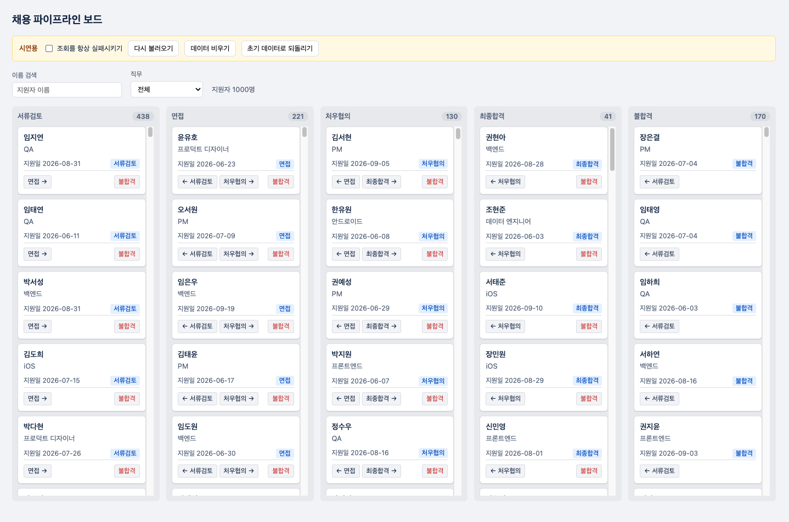
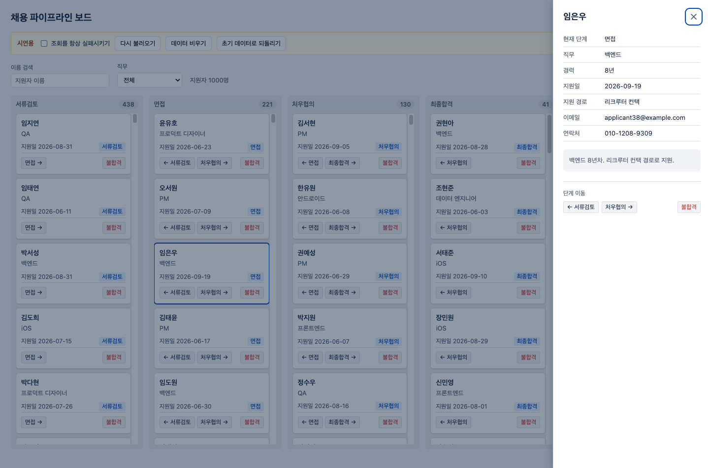
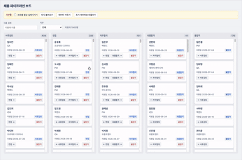

# 채용 파이프라인 보드

지원자를 채용 단계(`서류검토` → `면접` → `처우협의` → `최종합격` / `불합격`)별로 관리하는 보드.

실제 백엔드 없이 **직접 구현한 mock API**로 동작한다. 과제 요구대로 네트워크 지연(200~800ms)과 쓰기 실패(약 15%)를 시뮬레이션하고, 이동 결과는 새로고침 후에도 유지된다.



## 실행

```bash
npm install
npm run dev     # 개발 서버
npm test        # 단위 테스트 46건
npm run build   # 타입 검사 + 프로덕션 빌드
```

## 스택

| 항목 | 선택 | 한 줄 이유 |
|---|---|---|
| 빌드 | Vite 8 | 서버가 필요 없는 과제라 Next.js 대신 |
| 프레임워크 | React 19 + TypeScript 6 | — |
| 상태 관리 | `useReducer` 직접 구현 | 낙관적 업데이트 롤백이 평가 대상이라 라이브러리에 위임하지 않음 |
| 스타일 | 순수 CSS | 키보드 접근성 요구가 있어 마크업과 초점을 직접 통제 |
| mock API | 자체 구현 + `localStorage` | 지문이 자체 구현을 명시 |
| 테스트 | Vitest + jsdom | — |

근거는 [DECISIONS.md](DECISIONS.md) D1 · D2 · D3.

외부 UI 라이브러리, 상태 관리 라이브러리, 가상 스크롤 라이브러리, 아이콘 라이브러리를 모두 쓰지 않았다.
각각을 쓰지 않은 이유는 `DECISIONS.md`에 적었다.

## 구현 범위

지문의 요구사항을 작업 가능한 단위로 쪼개고 ID를 붙였다. **ID는 커밋 scope와 1:1로 대응하므로 `git log`에서 바로 찾을 수 있다.**

| ID | 구분 | 요구사항 | 커밋 scope | 상태 |
|---|---|---|---|---|
| M1 | Must | 단계별 컬럼에 지원자 카드 (이름·직무·지원일·현재 단계) | `board-layout` | ✅ |
| M2 | Must | 단계 이동 + mock API 저장 (새로고침 후 유지) | `stage-move` | ✅ |
| M3 | Must | 낙관적 업데이트 + 실패 시 롤백 + 사용자 피드백 | `optimistic-update` | ✅ |
| M4 | Must | 이름 검색 + 직무 필터 (200건 이상에서도 지연 없이) | `search-filter` | ✅ |
| M5 | Must | 카드 클릭 시 지원자 상세 | `detail-panel` | ✅ |
| M6 | Must | 로딩 / 에러 / 빈 상태 | `loading-error-empty` | ✅ |
| S1 | Should | 같은 카드 연속 이동 시 경쟁 상태 처리 | `race-condition` | ✅ |
| S2 | Should | 1,000건 기준 스크롤·필터 성능 (가상 스크롤) | `virtualization` | ✅ |
| S3 | Should | 되돌리기 | `undo` | ✅ |
| S4 | Should | 핵심 로직(롤백) 테스트 | `test` | ✅ |
| S5 | Should | 키보드만으로 단계 이동·상세 열람 | `a11y-keyboard` | ✅ |
| C1 | 제약 | mock API — 지연 200~800ms, 실패 약 15%, 영속 | `mock-api` | ✅ |

시드 데이터는 1,000건이다. 도전 요구사항의 기준이 1,000건이라 처음부터 그 규모로 만들었다.

완료하지 못한 개선 항목은 [DECISIONS.md 미완료 항목](DECISIONS.md#미완료-항목)에 정리했다.

## 주요 구현

### 낙관적 업데이트와 실패 롤백 (M3)


이동을 누르면 서버 응답을 기다리지 않고 화면을 먼저 바꾼다. 카드는 대상 컬럼 맨 위로 올라가고, 아직 확정되지 않았다는 뜻으로 점선 테두리와 흐린 배경이 붙는다.

실패하면 **단계와 표시 위치를 모두 원래대로 되돌리고** 토스트로 알린다. 위 녹화에서 컬럼 개수가 이렇게 움직인다.

```
서류검토 437 / 면접 226      이동 전
서류검토 436 / 면접 227      클릭 직후 — 화면에 먼저 반영
서류검토 437 / 면접 226      응답 실패 — 원래대로 복구 + 토스트
```

되돌릴 값으로 전체 목록이 아니라 **그 카드 한 장의 이전 단계와 이전 위치**만 들고 있다. 근거는 [DECISIONS.md](DECISIONS.md) D7.

### 지원자 상세 (M5)



카드를 누르면 보드 위에 패널이 뜬다. 보드 옆에 자리를 만들어 끼우면 패널이 열릴 때마다 보드가 밀려 카드가 좁아진다.

배경을 덮으므로 카드의 이동 버튼을 누를 수 없다. 그래서 **이동 버튼을 패널 안에 두었다.**
상세를 확인하고 그 자리에서 단계를 옮기는 흐름이 더 자연스럽다. 근거는 [DECISIONS.md](DECISIONS.md) D9.

닫는 방법은 세 가지다 — `Escape`, X 버튼, 배경 클릭.

### 경쟁 상태 처리 (S1)

같은 카드를 연속으로 누르면 요청이 겹쳐 서버 도착 순서가 클릭 순서와 달라질 수 있다.
카드별로 요청을 줄 세워 **서버 반영 순서와 조작 순서를 일치**시켰다. 화면은 줄을 서지 않고 즉시 바뀐다.

롤백 스냅샷은 첫 요청 때 한 번만 남기고, 마지막 응답이 도착했을 때만 확정하거나 되돌린다.
매번 덮어쓰면 **서버가 확정한 적 없는 값**으로 되돌아간다. 근거는 [DECISIONS.md](DECISIONS.md) D10.

### 대량 데이터 (S2)

컬럼마다 보이는 구간만 DOM에 그린다. 라이브러리 없이 직접 구현했다.

| | 적용 전 | 적용 후 |
|---|---|---|
| DOM 카드 | 1,000장 | 56장 |
| DOM 노드 | 6,034개 | 637개 |
| 스크롤 프레임 중앙값 | 8.3ms | 8.3ms |
| **스크롤 프레임 최대** | **311.9ms** | **9.4ms** |

중앙값은 그대로고 최대값이 사라졌다. **원래 문제가 평균이 아니라 간헐적 스파이크였기 때문이다.**
근거는 [DECISIONS.md](DECISIONS.md) D13.

### 키보드 접근성 (S5)

드래그앤드롭 대신 액션 버튼을 택해서 조작 자체는 처음부터 키보드로 가능하다. 별도 대체 경로가 없다.



실제로 문제였던 것은 **연속 작업**이다. 단계를 옮기면 카드가 다른 컬럼으로 이동하며 DOM에서 사라졌다 다시 생기고, 초점이 `body`로 떨어진다. 이동한 카드가 초점을 되찾도록 처리했다.

상세 패널이 열리면 초점이 패널 안에 갇히고, 닫으면 열었던 카드로 돌아온다. 패널에서 단계를 옮겨도 초점이 뒤쪽 보드로 새지 않는다.

| 조작 | 키 |
|---|---|
| 카드 사이 이동 | `Tab` / `Shift+Tab` |
| 상세 열기, 단계 이동 | `Enter` 또는 `Space` |
| 상세 닫기 | `Escape` |

근거는 [DECISIONS.md](DECISIONS.md) D11.

## 프로젝트 구조

```
src/
├─ types.ts                  도메인 타입, 단계 상수, 이동 규칙(getStageMoves)
├─ mock/
│  ├─ seed.ts                고정 시드 난수로 1,000건 생성
│  └─ api.ts                 지연·실패·localStorage 영속
├─ state/
│  ├─ applicantsReducer.ts   상태 전이 전부 (조회·이동·롤백·되돌리기)
│  ├─ useApplicants.ts       리듀서와 mock API 연결
│  ├─ requestQueue.ts        카드별 요청 직렬화
│  └─ focusRequest.ts        초점 이동 요청 타입
└─ components/
   ├─ Board / Column / ApplicantCard    보드 렌더
   ├─ BoardFilters / BoardStates        검색·필터, 로딩·에러·빈 상태
   ├─ DetailPanel / Toast / UndoBar     상세, 알림, 되돌리기
   ├─ useVisibleRange.ts                가상 스크롤 구간 계산
   └─ DemoControls.tsx                  시연용 mock 환경 조작
```

부수효과는 `state/`에, 화면은 `components/`에, 서버 흉내는 `mock/`에 두었다.
`applicantsReducer.ts`가 순수 함수라 렌더링 없이 상태 전이를 테스트할 수 있다.

## 테스트

```bash
npm test        # 46건
```

| 파일 | 건수 | 내용 |
|---|---|---|
| `mock/seed.test.ts` | 8 | 재현성, 이름 형식, 날짜, 단계 분포, 직무 분산 |
| `mock/api.test.ts` | 10 | 지연 범위, 실패율, 영속, **실패 시 저장소 무변경**, 목록 순서 |
| `state/applicantsReducer.test.ts` | 24 | 낙관적 이동, **롤백**, **경쟁 상태**, 되돌리기 |
| `types.test.ts` | 4 | 단계별 이동 가능 경로 |

확률과 시간을 다루는 항목은 표본을 충분히 잡고 허용 오차를 계산으로 정했다.
쓰기 실패율은 600회 시행의 표준편차(0.0146)를 기준으로 ±5%p(약 3.4σ)를 허용 범위로 두었다.

브라우저 동작은 실제 Chromium으로 기능마다 확인했다. 확인 결과는 [PROMPTS.md](PROMPTS.md)의 각 `리뷰 / 검증` 항목에 있다.

## 시연용 패널

보드 위쪽 노란색 패널은 제품 기능이 아니라 mock 환경을 조작하는 장치다.

| 조작 | 확인할 수 있는 것 |
|---|---|
| 조회를 항상 실패시키기 → 다시 불러오기 | 에러 상태 UI와 재시도 |
| 데이터 비우기 | 빈 상태 UI |
| 초기 데이터로 되돌리기 | 1,000건 복구 |

조회 실패와 빈 목록은 평소에 재현되지 않는다. 이 패널이 없으면 구현한 상태 UI를 확인할 방법이 없다.
근거는 [DECISIONS.md](DECISIONS.md) D4.

## 작업 순서를 이렇게 잡은 이유

지문 순서대로 만들지 않고 의존 관계를 따라 배치했다.

```
C1 mock-api → M1 board-layout → M6 loading-error-empty → M2 stage-move
   → M3 optimistic-update → S4 test → S1 race-condition
   → M4 search-filter → M5 detail-panel → S5 a11y-keyboard → S3 undo → S2 virtualization
```

- **C1이 맨 앞** — mock API가 없으면 나머지 기능이 얹힐 바닥이 없다.
- **M6이 M2보다 앞** — 데이터를 가져오는 순간 로딩·에러·빈 상태가 이미 생긴다. 나중에 끼워 넣으면 컴포넌트를 다시 열어야 한다.
- **M3 → S4 → S1이 붙어 있음** — 셋 다 "이동 중인 카드의 상태를 어떻게 들고 있는가"라는 같은 문제를 푼다.
  S1을 도전 과제라는 이유로 뒤로 미루면 낙관적 업데이트를 두 번 짜게 된다.
- **M4가 M2·M3보다 뒤** — 필터가 걸린 상태에서 카드를 이동시키면 화면 순서와 원본 순서가 어긋난다. 이동을 먼저 안정시켰다.
- **S2가 맨 뒤** — 가상 스크롤은 렌더링 구조를 바꾸므로, 기능이 다 들어간 뒤에 얹어야 기존 동작을 깨뜨렸는지 판단할 수 있다.

## 문서

- [PROMPTS.md](PROMPTS.md) — 기능별 프롬프트와 `리뷰 / 검증` 기록
- [DECISIONS.md](DECISIONS.md) — 설계 결정 13건, 스스로 세운 가정, 미완료 항목
