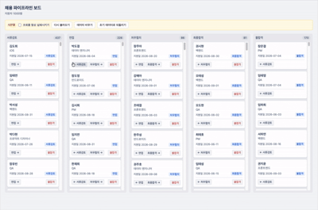

# 채용 파이프라인 보드

지원자를 채용 단계(`서류검토` → `면접` → `처우협의` → `최종합격` / `불합격`)별로 관리하는 보드.

실제 백엔드 없이 **직접 구현한 mock API**로 동작한다. 과제 요구대로 네트워크 지연(200~800ms)과 실패(약 15%)를 시뮬레이션한다.

## 실행

```bash
npm install
npm run dev     # 개발 서버
npm test        # 단위 테스트
```

## 스택

| 항목 | 선택 |
|---|---|
| 빌드 | Vite 8 |
| 프레임워크 | React 19 + TypeScript 6 |
| 스타일 | 순수 CSS (UI 라이브러리 없음) |
| 린트 | oxlint (Vite 템플릿 기본) |

선택 근거는 [DECISIONS.md](DECISIONS.md) D1.

## 문서

- [PROMPTS.md](PROMPTS.md) — 기능별 프롬프트와 리뷰/검증 기록
- [DECISIONS.md](DECISIONS.md) — 설계 결정과 그 근거

## 낙관적 업데이트와 롤백



이동을 누르면 서버 응답을 기다리지 않고 화면을 먼저 바꾼다. 카드는 대상 컬럼 맨 위로 올라가고,
아직 확정되지 않았다는 뜻으로 점선 테두리와 흐린 배경이 붙는다.

mock API는 쓰기 요청을 약 15% 확률로 실패시킨다. 실패하면 **단계와 표시 위치를 모두 원래대로 되돌리고** 토스트로 알린다.

위 녹화에서 컬럼 개수가 이렇게 움직인다.

```
서류검토 437 / 면접 226      이동 전
서류검토 436 / 면접 227      클릭 직후 — 화면에 먼저 반영
서류검토 437 / 면접 226      응답 실패 — 원래대로 복구 + 토스트
```

되돌릴 값으로 전체 목록이 아니라 **그 카드 한 장의 이전 단계와 이전 위치**만 들고 있다.
근거는 [DECISIONS.md](DECISIONS.md) D7.

## 시연용 패널

보드 위 노란색 패널은 제품 기능이 아니라 mock 환경 조작 장치다.
조회 실패와 빈 목록은 평소에 재현되지 않아서, 이 패널이 없으면 에러·빈 상태 UI를 확인할 방법이 없다.
근거는 [DECISIONS.md](DECISIONS.md) D4.

## 요구사항 분해

지문의 요구사항을 작업 가능한 단위로 쪼개고 ID를 붙였다. ID는 커밋 scope와 1:1로 대응한다.

| ID | 구분 | 요구사항 | 커밋 scope | 작업 순서 | 상태 |
|---|---|---|---|---|---|
| M1 | Must | 단계별 컬럼에 지원자 카드 (이름·직무·지원일·현재 단계) | `board-layout` | 2 | ✅ |
| M2 | Must | 단계 이동 + mock API 저장 (새로고침 후 유지) | `stage-move` | 4 | ✅ |
| M3 | Must | 낙관적 업데이트 + 실패 시 롤백 + 사용자 피드백 | `optimistic-update` | 5 | ✅ |
| M4 | Must | 이름 검색 + 직무 필터 (200건 이상에서도 지연 없이) | `search-filter` | 8 | ✅ |
| M5 | Must | 카드 클릭 시 지원자 상세 | `detail-panel` | 9 | ✅ |
| M6 | Must | 로딩 / 에러 / 빈 상태 | `loading-error-empty` | 3 | ✅ |
| S1 | Should | 같은 카드 연속 이동 시 경쟁 상태 처리 | `race-condition` | 6 | ✅ |
| S2 | Should | 1,000건 기준 스크롤·필터 성능 (가상 스크롤) | `virtualization` | 12 | |
| S3 | Should | 되돌리기 | `undo` | 11 | |
| S4 | Should | 핵심 로직(롤백) 테스트 | `test` | 7 | ✅ |
| S5 | Should | 키보드만으로 단계 이동·상세 열람 | `a11y-keyboard` | 10 | ✅ |
| C1 | 제약 | mock API — 지연 200~800ms, 실패 약 15%, 영속 | `mock-api` | 1 | ✅ |

### 작업 순서를 이렇게 잡은 이유

지문 순서대로 만들지 않았다. 의존 관계를 따라 배치했다.

- **C1이 맨 앞** — mock API가 없으면 나머지 기능이 얹힐 바닥이 없다.
- **M6이 M2보다 앞** — 데이터를 가져오는 순간 로딩·에러·빈 상태가 이미 생긴다. 나중에 끼워 넣으면 컴포넌트를 다시 열어야 한다.
- **M3 → S1 → S4가 붙어 있음** — 셋 다 "이동 중인 카드의 상태를 어떻게 들고 있는가"라는 같은 문제를 푼다.
  S1을 도전 과제라는 이유로 뒤로 미루면 낙관적 업데이트를 두 번 짜게 된다.
- **M4가 M2·M3보다 뒤** — 필터가 걸린 상태에서 카드를 이동시키면 화면에 보이는 순서와 원본 순서가 어긋난다.
  이동을 먼저 안정시켜 두는 편이 낫다.
- **S2가 맨 뒤** — 가상 스크롤은 렌더링 구조를 바꾸므로, 기능이 다 들어간 뒤에 얹어야 기존 동작을 깨뜨렸는지 판단할 수 있다.

Must를 전부 끝낸 뒤 Should에 손대되, S1·S4는 위 이유로 M3 직후에 처리한다.
